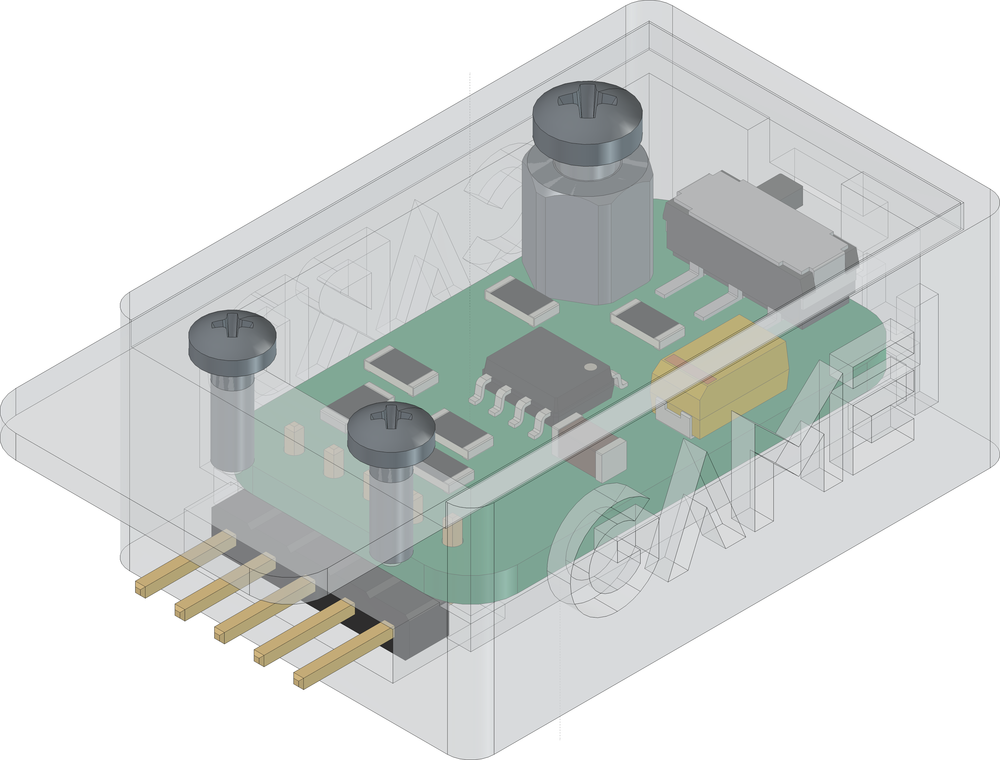
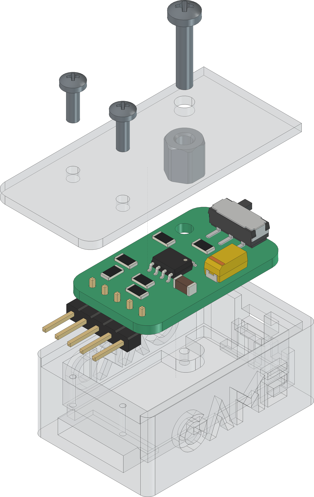

  

# `GCA` - Game Card Adapter

The `GCA` is a board with a [AT24CM0X](#additional-information) `EEPROM` or any other compatible `EEPROM`. The board itself can be driven with a voltage from `3V3-5V` and is used chainload games onto the [GamePad](https://github.com/0x007e/gap) over the integrated bootloader (currently under development). 

| Experience  | Level                                                                               |
|:------------|:-----------------------------------------------------------------------------------:|
| Soldering   |  |
| Mechanical  |     |

# Downloads

| Type      | File                                                                                                                                                 | Description     |
|:---------:|:----------------------------------------------------------------------------------------------------------------------------------------------------:|:----------------|
| Schematic | [pdf](https://github.com/0x007E/gca/releases/latest/download/schematic.pdf) / [cadlab](https://cadlab.io/project/30397/main/files)                   | Schematic files |
| Board     | [pdf](https://github.com/0x007E/gca/releases/latest/download/pcb.pdf) / [cadlab](https://cadlab.io/project/30397/main/files)                         | Board file      |
| Drill     | [pdf](https://github.com/0x007E/gca/releases/latest/download/drill.pdf)                                                                              | Drill file      |
| BoM | [xlsx](https://github.com/0x007E/gca/releases/latest/download/bom.xlsx) / [html](https://github.com/0x007E/gca/releases/latest/download/bom.html)          | Bill of Material as Excel/interactive HTML |
| PCB    | [zip](https://github.com/0x007E/gca/releases/latest/download/kicad.zip) / [tar](https://github.com/0x007E/gca/releases/latest/download/kicad.tar.gz)    | KiCAD/Gerber/BoM/Drill files       |
| Mechanical | [zip](https://github.com/0x007E/gca/releases/latest/download/freecad.zip) / [tar](https://github.com/0x007E/gca/releases/latest/download/freecad.tar.gz) | FreeCAD/Housing and PCB (STEP/STL) files     |

# Hardware

The pcb is created with `KiCAD`, the housing with `FreeCAD`. All files are built with `github actions` so that they are ready for a production environment.

## PCB

The circuit board is populated on both sides (Top, Bottom). The best way for soldering the `SMD` components is within a vapor phase soldering system and for the `THT` components with a standard soldering system.

### Top Layer

### Bottom Layer

## Mechanical

The housing has a tolerance of `0.2mm` on each side of the case. So the pcb should fit perfectly in the housing. The tolerance can be modified with `FreeCAD` in the `Parameter` Spreadsheet.

### Assembled

### Exploded

# Additional Information

| Type       | Link               | Description              |
|:----------:|:------------------:|:-------------------------|
| AT24CM02 | [pdf](https://ww1.microchip.com/downloads/en/DeviceDoc/AT24CM02-I2C-Compatible-Two-Wire-Serial-EEPROM-2-Mbit-262,144x8-20006197C.pdf) | 2-MBit serial EEPROM dataseheet |
| AT24CM01 | [pdf](https://ww1.microchip.com/downloads/en/DeviceDoc/AT24CM01-I2C-Compatible-Two-Wire-Serial-EEPROM-Data-Sheet-20006170A.pdf) | 1-MBit serial EEPROM datasheet |

---
